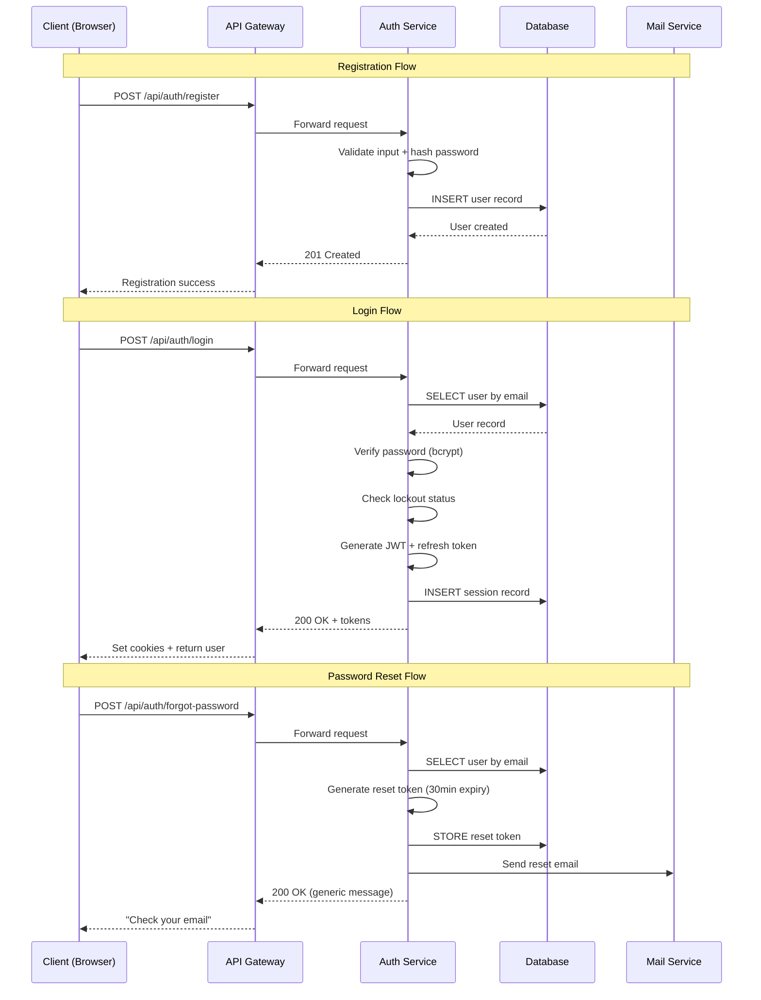
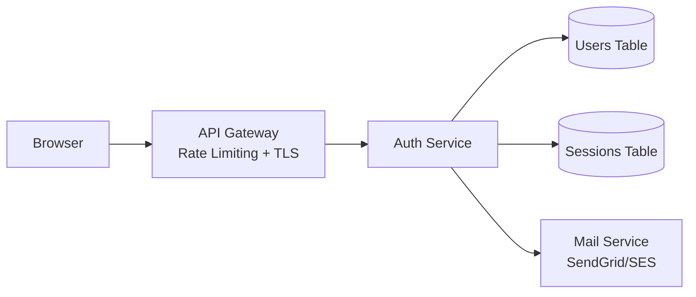
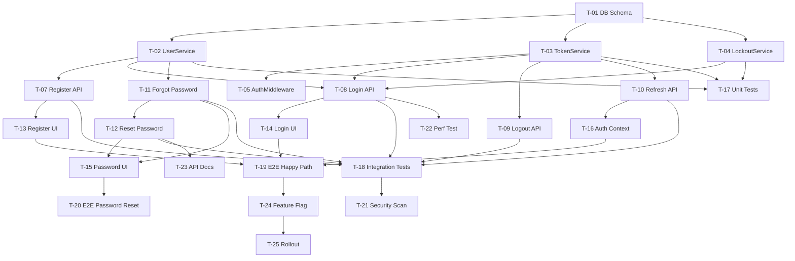

# Spec-Driven Development Example: User Authentication

> Complete example showing requirements (EARS notation), technical design, and implementation plan for a user authentication feature.

---

## Part 1: Requirements (EARS Notation)

### Metadata

| Field     | Value                       |
|-----------|-----------------------------|
| Author    | @lead-engineer              |
| Created   | 2026-01-15                  |
| Updated   | 2026-02-01                  |
| Status    | Approved                    |
| Tracking  | AUTH-100                    |

### Glossary

| Term | Definition |
|------|------------|
| User | A person who interacts with the application via browser or mobile. |
| Credential | A combination of email + password used to authenticate. |
| Session | A server-side record linking a browser cookie to an authenticated user. |
| JWT | JSON Web Token — a signed, stateless token for API authentication. |
| MFA | Multi-Factor Authentication — requiring a second verification step. |
| Lockout | Temporary disabling of login for an account after repeated failures. |

### Universal Requirements

| ID   | Requirement |
|------|-------------|
| U-01 | The system shall store all passwords using bcrypt with a minimum cost factor of 12. |
| U-02 | The system shall enforce HTTPS for all authentication-related endpoints. |
| U-03 | The system shall log all authentication events (login, logout, failure, lockout) with timestamp, user ID, IP address, and user agent. |

### Event-Driven Requirements

| ID   | Requirement |
|------|-------------|
| E-01 | When the user submits the registration form, the system shall create a new user account with email, hashed password, and display name. |
| E-02 | When the user submits valid login credentials, the system shall create a session and return a JWT access token (1h expiry) and a refresh token (7d expiry). |
| E-03 | When the user submits invalid login credentials, the system shall return a generic "Invalid email or password" error without revealing which field is incorrect. |
| E-04 | When the user clicks "Logout", the system shall invalidate the current session and clear authentication cookies. |
| E-05 | When the user requests a password reset, the system shall send a reset link to the registered email address with a token valid for 30 minutes. |
| E-06 | When the user submits a valid password reset token with a new password, the system shall update the password and invalidate all existing sessions. |
| E-07 | When the JWT access token expires, the client shall use the refresh token to obtain a new access token without user interaction. |

### State-Driven Requirements

| ID   | Requirement |
|------|-------------|
| S-01 | While the user is authenticated, the system shall include the user's role and permissions in the JWT payload. |
| S-02 | While the account is locked, the system shall reject all login attempts and display the remaining lockout duration. |
| S-03 | While the user session is active, the system shall extend the session expiry on each authenticated request (sliding window). |

### Optional Feature Requirements

| ID   | Requirement |
|------|-------------|
| O-01 | Where MFA is enabled for the user, the system shall require a 6-digit TOTP code after successful password verification. |
| O-02 | Where the "Remember Me" option is selected, the system shall extend the refresh token expiry to 30 days. |

### Unwanted Behavior Requirements

| ID   | Requirement |
|------|-------------|
| N-01 | If a user attempts login 5 times with incorrect credentials within 15 minutes, the system shall lock the account for 30 minutes. |
| N-02 | If the password reset token is expired or invalid, the system shall display "This link has expired. Please request a new password reset." |
| N-03 | If the registration email is already associated with an existing account, the system shall return a generic success message (to prevent email enumeration) and send an email to the existing user notifying them of the attempt. |
| N-04 | If the refresh token is expired or revoked, the system shall return HTTP 401 and redirect the client to the login page. |
| N-05 | If the JWT signature verification fails, the system shall reject the request with HTTP 401 and log a security warning. |

### Combination Requirements

| ID   | Requirement |
|------|-------------|
| C-01 | Where MFA is enabled, when the user submits a valid password, the system shall present the TOTP input form before completing authentication. |
| C-02 | While the account is locked, if the user requests a password reset, the system shall allow the reset flow and unlock the account upon successful password change. |

### Non-Functional Requirements

| ID    | Category     | Requirement |
|-------|-------------|-------------|
| NF-01 | Performance | When the user submits login credentials, the system shall respond within 500ms at the 95th percentile. |
| NF-02 | Security    | The system shall rate-limit the /auth/* endpoints to 20 requests per minute per IP address. |
| NF-03 | Availability | The authentication service shall maintain 99.9% uptime measured monthly. |

### Traceability Matrix

| Req ID | Pattern | Category | Summary | Design Ref | Implementation | Test Case | Status |
|--------|---------|----------|---------|------------|----------------|-----------|--------|
| U-01 | Universal | Security | Bcrypt password hashing | §5.1 | UserService.hashPassword() | TC-SEC-01 | Done |
| U-02 | Universal | Security | HTTPS enforcement | §7 Infra | nginx.conf TLS | TC-SEC-02 | Done |
| U-03 | Universal | Audit | Log auth events | §5.3 | AuditLogger middleware | TC-AUD-01 | Done |
| E-01 | Event | Registration | Create user account | §6.1 POST /register | AuthController.register() | TC-REG-01 | Done |
| E-02 | Event | Login | Issue JWT + refresh | §6.2 POST /login | AuthController.login() | TC-AUTH-01 | Done |
| E-03 | Event | Login | Generic error on failure | §6.2 | AuthController.login() | TC-AUTH-02 | Done |
| E-04 | Event | Logout | Invalidate session | §6.3 POST /logout | AuthController.logout() | TC-AUTH-03 | Done |
| E-05 | Event | Password | Send reset email | §6.4 POST /forgot | PasswordService.forgot() | TC-PWD-01 | In Progress |
| E-06 | Event | Password | Reset password | §6.5 POST /reset | PasswordService.reset() | TC-PWD-02 | In Progress |
| E-07 | Event | Token | Refresh access token | §6.6 POST /refresh | TokenService.refresh() | TC-TOK-01 | Done |
| S-01 | State | Authorization | Role in JWT payload | §5.2 | TokenService.sign() | TC-AUTH-04 | Done |
| S-02 | State | Security | Reject locked account | §5.4 | LockoutService | TC-SEC-03 | Done |
| S-03 | State | Session | Sliding window expiry | §5.2 | SessionMiddleware | TC-SES-01 | Not Started |
| O-01 | Optional | MFA | Require TOTP | §5.5 | MfaService | TC-MFA-01 | Not Started |
| O-02 | Optional | UX | Extended refresh token | §5.2 | TokenService | TC-TOK-02 | Not Started |
| N-01 | Unwanted | Security | Account lockout | §5.4 | LockoutService | TC-SEC-04 | Done |
| N-02 | Unwanted | Password | Expired reset token | §6.5 | PasswordService | TC-PWD-03 | In Progress |
| N-03 | Unwanted | Security | Prevent email enumeration | §6.1 | AuthController | TC-SEC-05 | Done |
| N-04 | Unwanted | Token | Expired refresh token | §6.6 | TokenService | TC-TOK-03 | Done |
| N-05 | Unwanted | Security | Invalid JWT signature | §5.2 | AuthMiddleware | TC-SEC-06 | Done |

---

## Part 2: Technical Design

### Metadata

| Field       | Value                        |
|-------------|------------------------------|
| Author(s)   | @lead-engineer               |
| Status      | Approved                     |
| Created     | 2026-01-18                   |
| Updated     | 2026-02-01                   |
| Reviewers   | @security-lead, @backend-lead|
| Tracking    | AUTH-100                     |

### Overview

This design implements email/password authentication with JWT-based sessions for the Kitchen Odyssey application. The system supports registration, login, logout, password reset, account lockout, and optional MFA. JWTs are issued as access tokens (short-lived) with refresh tokens (long-lived) to balance security and user experience.

### Goals

- Provide secure email/password authentication with bcrypt hashing and JWT tokens.
- Support password reset via email with time-limited tokens.
- Implement account lockout after repeated failed login attempts.
- Achieve sub-500ms login latency at p95.

### Non-Goals

- OAuth/social login (deferred to Phase 2).
- SAML/SSO for enterprise accounts.
- Biometric authentication.
- User profile management (separate feature).

### Architecture





### Component Responsibilities

| Component | Responsibility |
|-----------|----------------|
| API Gateway | TLS termination, rate limiting (20 req/min/IP on /auth/*), request routing |
| Auth Service | Registration, login, logout, password reset, token management, lockout logic |
| Users Table | User credentials, profile, MFA configuration, lockout state |
| Sessions Table | Active refresh tokens, device info, expiry timestamps |
| Mail Service | Transactional emails for password reset and security alerts |

### Data Model

#### Entity: User

| Field | Type | Constraints |
|-------|------|-------------|
| id | UUID | PK, auto-generated |
| email | varchar(255) | unique, indexed, lowercase |
| password_hash | varchar(255) | bcrypt, cost factor 12 |
| display_name | varchar(100) | not null |
| role | enum | 'user', 'admin'; default: 'user' |
| mfa_enabled | boolean | default: false |
| mfa_secret | varchar(255) | encrypted, nullable |
| failed_login_count | integer | default: 0 |
| locked_until | timestamp | nullable |
| created_at | timestamp | default: now() |
| updated_at | timestamp | auto-updated |

#### Entity: Session

| Field | Type | Constraints |
|-------|------|-------------|
| id | UUID | PK |
| user_id | UUID | FK → User.id, indexed |
| refresh_token_hash | varchar(255) | hashed, unique |
| user_agent | varchar(500) | |
| ip_address | varchar(45) | IPv4/IPv6 |
| expires_at | timestamp | |
| created_at | timestamp | default: now() |

#### Entity: PasswordResetToken

| Field | Type | Constraints |
|-------|------|-------------|
| id | UUID | PK |
| user_id | UUID | FK → User.id |
| token_hash | varchar(255) | hashed, unique |
| expires_at | timestamp | 30 min from creation |
| used | boolean | default: false |
| created_at | timestamp | default: now() |

### API Design

#### POST /api/auth/register

**Request:**
```json
{
  "email": "jane@example.com",
  "password": "SecureP@ss123",
  "display_name": "Jane Doe"
}
```

**Success (201):**
```json
{
  "message": "Account created successfully.",
  "user": { "id": "uuid", "email": "jane@example.com", "display_name": "Jane Doe" }
}
```

**Errors:** 400 `validation_error` (invalid fields), 409 generic success (email exists — anti-enumeration).

---

#### POST /api/auth/login

**Request:**
```json
{
  "email": "jane@example.com",
  "password": "SecureP@ss123",
  "remember_me": false
}
```

**Success (200):**
```json
{
  "access_token": "eyJhbGciOiJSUzI1NiIs...",
  "token_type": "Bearer",
  "expires_in": 3600,
  "user": { "id": "uuid", "email": "jane@example.com", "display_name": "Jane Doe", "role": "user" }
}
```
*Refresh token set as HttpOnly cookie.*

**Errors:** 401 `invalid_credentials`, 423 `account_locked` (includes `retry_after` seconds).

---

#### POST /api/auth/logout

**Headers:** `Authorization: Bearer <token>`

**Success (200):**
```json
{ "message": "Logged out successfully." }
```

---

#### POST /api/auth/refresh

**Cookie:** `refresh_token=<token>`

**Success (200):**
```json
{
  "access_token": "eyJhbGciOiJSUzI1NiIs...",
  "token_type": "Bearer",
  "expires_in": 3600
}
```

**Errors:** 401 `token_expired`, 401 `token_revoked`.

---

#### POST /api/auth/forgot-password

**Request:**
```json
{ "email": "jane@example.com" }
```

**Success (200):** Always returns `{ "message": "If an account exists, a reset link has been sent." }`

---

#### POST /api/auth/reset-password

**Request:**
```json
{
  "token": "reset-token-value",
  "new_password": "NewSecureP@ss456"
}
```

**Success (200):**
```json
{ "message": "Password reset successfully. Please log in." }
```

**Errors:** 400 `token_expired`, 400 `token_invalid`.

### Security Considerations

- **Passwords:** Bcrypt with cost factor 12. Never logged, never returned in API responses.
- **Tokens:** Access tokens signed with RS256. Refresh tokens hashed (SHA-256) before storage.
- **Cookies:** Refresh token in HttpOnly, Secure, SameSite=Strict cookie.
- **Rate limiting:** 20 req/min/IP on all /auth/* endpoints.
- **Lockout:** 5 failures in 15 min → 30 min lockout. Counter resets on successful login.
- **Enumeration:** Registration and password reset return generic messages regardless of email existence.
- **CSRF:** SameSite=Strict cookie + CSRF token for state-changing operations.
- **Logging:** All auth events logged. Passwords and tokens never appear in logs.

### Testing Strategy

| Level | Scope | Tool |
|-------|-------|------|
| Unit | Password hashing, token generation, lockout logic, input validation | Jest |
| Integration | Full login/register/reset flows against test DB | Supertest + test DB |
| E2E | Register → Login → Dashboard → Logout browser flow | Playwright |
| Security | OWASP ZAP scan on /auth/* endpoints | OWASP ZAP |
| Performance | 500 concurrent login requests | k6 |

### Rollout Plan

| Phase | Audience | Duration | Success Criteria | Rollback |
|-------|----------|----------|------------------|----------|
| 1 | Dev team | 3 days | Zero auth errors | Revert PR |
| 2 | 10% users | 5 days | Error rate < 0.5% | Disable flag |
| 3 | 100% | — | Flag removed | — |

**Feature flag:** `auth_v2_enabled` (default: false)

### Alternatives Considered

#### A. Firebase Auth
- **Pros:** Managed, quick setup, many providers.
- **Cons:** Vendor lock-in, limited lockout customization, cost at scale.
- **Verdict:** Rejected — need full control over lockout and session logic.

#### B. NextAuth.js
- **Pros:** Built for Next.js, good DX, supports many providers.
- **Cons:** Opinionated session handling conflicts with our JWT approach.
- **Verdict:** Deferred — may adopt for OAuth/social login in Phase 2.

---

## Part 3: Implementation Plan

### Summary

Implement the user authentication system as designed. Broken into 3 phases: foundation (data model, core services), feature implementation (API endpoints, UI pages), and quality/release (testing, docs, rollout).

### Task Breakdown

#### Phase 1: Foundation (Week 1)

| ID | Task | Assignee | Est. | Depends On | Reqs | Status |
|----|------|----------|------|------------|------|--------|
| T-01 | Create User, Session, PasswordResetToken database schemas + migrations | @backend | 3h | — | U-01, E-01 | Done |
| T-02 | Implement UserService (create, findByEmail, updatePassword) | @backend | 4h | T-01 | E-01, E-06 | Done |
| T-03 | Implement TokenService (sign JWT, verify, refresh logic) | @backend | 4h | T-01 | E-02, E-07, S-01 | Done |
| T-04 | Implement LockoutService (track failures, lock/unlock account) | @backend | 3h | T-01 | N-01, S-02 | Done |
| T-05 | Implement AuthMiddleware (JWT verification on protected routes) | @backend | 2h | T-03 | N-05 | Done |
| T-06 | Set up audit logging middleware for auth events | @backend | 2h | — | U-03 | Done |

#### Phase 2: Feature Implementation (Week 2)

| ID | Task | Assignee | Est. | Depends On | Reqs | Status |
|----|------|----------|------|------------|------|--------|
| T-07 | POST /api/auth/register endpoint | @backend | 3h | T-02 | E-01, N-03 | Done |
| T-08 | POST /api/auth/login endpoint | @backend | 4h | T-02, T-03, T-04 | E-02, E-03, N-01 | Done |
| T-09 | POST /api/auth/logout endpoint | @backend | 2h | T-03 | E-04 | Done |
| T-10 | POST /api/auth/refresh endpoint | @backend | 2h | T-03 | E-07, N-04 | Done |
| T-11 | POST /api/auth/forgot-password endpoint + email sending | @backend | 4h | T-02 | E-05, N-03 | In Progress |
| T-12 | POST /api/auth/reset-password endpoint | @backend | 3h | T-11 | E-06, N-02 | In Progress |
| T-13 | Registration page (form, validation, API call) | @frontend | 4h | T-07 | E-01 | Done |
| T-14 | Login page (form, validation, error display, lockout message) | @frontend | 4h | T-08 | E-02, E-03, S-02 | Done |
| T-15 | Forgot Password page + Reset Password page | @frontend | 4h | T-11, T-12 | E-05, E-06 | In Progress |
| T-16 | Auth context provider (token storage, auto-refresh, logout) | @frontend | 4h | T-10 | E-07, S-03 | Done |

#### Phase 3: Quality & Release (Week 3)

| ID | Task | Assignee | Est. | Depends On | Reqs | Status |
|----|------|----------|------|------------|------|--------|
| T-17 | Unit tests for UserService, TokenService, LockoutService | @backend | 4h | T-02, T-03, T-04 | — | Done |
| T-18 | Integration tests for all /auth/* endpoints | @backend | 6h | T-07–T-12 | — | In Progress |
| T-19 | E2E tests: Register → Login → Dashboard → Logout | @qa | 4h | T-13, T-14, T-16 | — | Not Started |
| T-20 | E2E tests: Forgot Password → Reset → Login | @qa | 3h | T-15, T-12 | — | Not Started |
| T-21 | Security scan with OWASP ZAP on /auth/* | @security | 2h | T-07–T-12 | NF-02 | Not Started |
| T-22 | Performance test: 500 concurrent logins | @backend | 3h | T-08 | NF-01 | Not Started |
| T-23 | API documentation for all auth endpoints | @backend | 2h | T-07–T-12 | — | Not Started |
| T-24 | Set up feature flag `auth_v2_enabled` | @devops | 1h | — | — | Not Started |
| T-25 | Phased rollout: internal → 10% → 100% | @devops | — | T-24 | — | Not Started |

### Dependency Graph



### Risk Register

| Risk | Likelihood | Impact | Mitigation |
|------|------------|--------|------------|
| Email delivery delays affect password reset UX | Medium | Medium | Use reliable provider (SES/SendGrid), add "resend" button with 60s cooldown |
| Bcrypt hashing slows login under load | Low | Medium | bcrypt cost 12 benchmarked at ~250ms; acceptable. Monitor p95. |
| Token theft via XSS | Low | High | HttpOnly cookies, CSP headers, no tokens in localStorage |
| Account lockout used for denial-of-service | Medium | Medium | Lockout is per-account (not IP); legitimate user can reset password to unlock |

### Progress Log

#### 2026-01-20
- Completed Phase 1 foundation tasks (T-01 through T-06).
- All database schemas created and migrated.
- Core services implemented with unit tests.

#### 2026-01-27
- Completed Phase 2 API endpoints (T-07 through T-10) and UI pages (T-13, T-14, T-16).
- Password reset flow (T-11, T-12, T-15) in progress — email integration pending SendGrid API key.

#### 2026-02-01
- Unit tests done (T-17). Integration tests in progress (T-18).
- Password reset email sending works in dev; testing in staging next.
- Remaining: E2E tests, security scan, perf test, feature flag, rollout.
