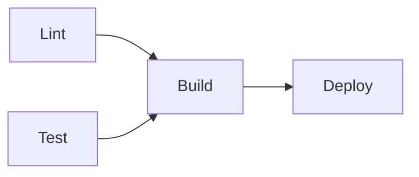
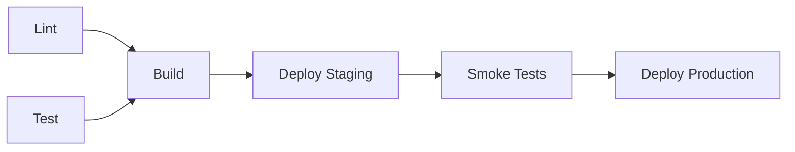
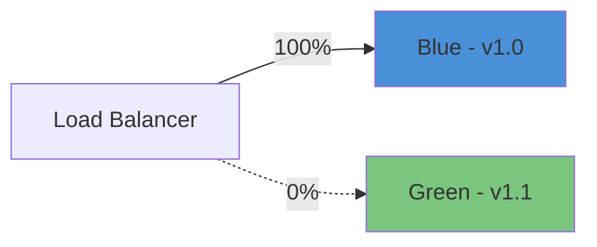

# CI/CD Pipeline Patterns Reference

> Patterns, strategies, and recipes for building production-grade CI/CD pipelines with GitHub Actions.

---

## GitHub Actions Workflow Anatomy

```yaml
name: CI                          # Workflow name (displayed in GitHub UI)

on:                                # Trigger events
  push:
    branches: [main]
  pull_request:
    branches: [main]
  workflow_dispatch:               # Manual trigger

permissions:                       # Minimum required permissions
  contents: read
  pull-requests: write

concurrency:                       # Prevent duplicate runs
  group: ${{ github.workflow }}-${{ github.ref }}
  cancel-in-progress: true

env:                               # Workflow-level environment variables
  NODE_VERSION: '20'

jobs:
  test:                            # Job identifier
    name: Run Tests                # Display name
    runs-on: ubuntu-latest         # Runner OS
    timeout-minutes: 15            # Safety timeout
    steps:
      - uses: actions/checkout@v4
      - name: Setup Node
        uses: actions/setup-node@v4
        with:
          node-version: ${{ env.NODE_VERSION }}
      - run: npm ci
      - run: npm test
```

### Key Concepts

| Concept | Description |
|---------|-------------|
| **Workflow** | A YAML file in `.github/workflows/`. Triggered by events. |
| **Job** | A set of steps that run on the same runner. Jobs run in parallel by default. |
| **Step** | A single task — either an action (`uses:`) or a shell command (`run:`). |
| **Runner** | The VM that executes a job. `ubuntu-latest`, `windows-latest`, `macos-latest`. |
| **Action** | A reusable unit of code. Referenced by `owner/repo@version`. |
| **Context** | Variables like `github.ref`, `github.sha`, `secrets.TOKEN`. |

---

## Job Dependencies

```yaml
jobs:
  lint:
    runs-on: ubuntu-latest
    steps: [...]

  test:
    runs-on: ubuntu-latest
    steps: [...]

  build:
    needs: [lint, test]            # Waits for lint AND test to pass
    runs-on: ubuntu-latest
    steps: [...]

  deploy:
    needs: build
    if: github.ref == 'refs/heads/main'  # Only on main branch
    runs-on: ubuntu-latest
    steps: [...]
```



---

## Matrix Builds

Test across multiple versions, OSes, or configurations in parallel.

```yaml
jobs:
  test:
    strategy:
      fail-fast: false             # Don't cancel other matrix jobs on failure
      matrix:
        os: [ubuntu-latest, windows-latest]
        node-version: [18, 20, 22]
        exclude:
          - os: windows-latest
            node-version: 18
        include:
          - os: ubuntu-latest
            node-version: 20
            coverage: true         # Extra variable for specific combination
    runs-on: ${{ matrix.os }}
    steps:
      - uses: actions/checkout@v4
      - uses: actions/setup-node@v4
        with:
          node-version: ${{ matrix.node-version }}
      - run: npm ci
      - run: npm test
      - if: matrix.coverage
        run: npm run test:coverage
```

---

## Caching Strategies

### Node.js (npm / pnpm)

```yaml
- uses: actions/setup-node@v4
  with:
    node-version: '20'
    cache: 'npm'                   # Built-in caching for npm

# Or manual caching for more control:
- uses: actions/cache@v4
  with:
    path: node_modules
    key: node-${{ runner.os }}-${{ hashFiles('package-lock.json') }}
    restore-keys: |
      node-${{ runner.os }}-
```

### Python (pip)

```yaml
- uses: actions/setup-python@v5
  with:
    python-version: '3.12'
    cache: 'pip'                   # Built-in pip caching

# Manual:
- uses: actions/cache@v4
  with:
    path: ~/.cache/pip
    key: pip-${{ runner.os }}-${{ hashFiles('requirements.txt') }}
```

### Docker Layers

```yaml
- uses: docker/build-push-action@v5
  with:
    cache-from: type=gha
    cache-to: type=gha,mode=max
```

### Cache Tips

- Always hash the lockfile (`hashFiles('package-lock.json')`).
- Use `restore-keys` for partial cache hits (faster than cold install).
- Cache limit is 10 GB per repository. Caches evicted after 7 days of inactivity.
- Use `actions/cache/restore` and `actions/cache/save` for split save/restore control.

---

## Artifact Management

### Upload Artifacts

```yaml
- uses: actions/upload-artifact@v4
  with:
    name: build-output
    path: dist/
    retention-days: 5              # Default is 90 days
    if-no-files-found: error       # Fail if no files matched
```

### Download Artifacts (in a downstream job)

```yaml
deploy:
  needs: build
  steps:
    - uses: actions/download-artifact@v4
      with:
        name: build-output
        path: dist/
```

### Share Data Between Jobs

```yaml
jobs:
  compute:
    outputs:
      version: ${{ steps.ver.outputs.version }}
    steps:
      - id: ver
        run: echo "version=$(cat VERSION)" >> "$GITHUB_OUTPUT"

  use:
    needs: compute
    steps:
      - run: echo "Deploying version ${{ needs.compute.outputs.version }}"
```

---

## Environment Protection Rules

```yaml
jobs:
  deploy-prod:
    environment:
      name: production
      url: https://app.example.com
    steps:
      - run: ./deploy.sh
```

Configure in **Settings → Environments**:
- **Required reviewers** — one or more people must approve before the job runs.
- **Wait timer** — delay N minutes before allowing deployment.
- **Branch restrictions** — only allow deployments from specific branches.
- **Deployment secrets** — secrets scoped to the environment (e.g., `PROD_API_KEY`).

---

## Reusable Workflows

### Define a reusable workflow

```yaml
# .github/workflows/reusable-test.yml
name: Reusable Test

on:
  workflow_call:                   # Makes this workflow callable
    inputs:
      node-version:
        required: false
        type: string
        default: '20'
    secrets:
      NPM_TOKEN:
        required: false

jobs:
  test:
    runs-on: ubuntu-latest
    steps:
      - uses: actions/checkout@v4
      - uses: actions/setup-node@v4
        with:
          node-version: ${{ inputs.node-version }}
      - run: npm ci
      - run: npm test
```

### Call a reusable workflow

```yaml
# .github/workflows/ci.yml
jobs:
  test:
    uses: ./.github/workflows/reusable-test.yml
    with:
      node-version: '20'
    secrets:
      NPM_TOKEN: ${{ secrets.NPM_TOKEN }}
```

---

## Composite Actions

Create a local reusable action in your repository.

```yaml
# .github/actions/setup-project/action.yml
name: Setup Project
description: Install dependencies and build

inputs:
  node-version:
    description: Node.js version
    default: '20'

runs:
  using: composite
  steps:
    - uses: actions/setup-node@v4
      with:
        node-version: ${{ inputs.node-version }}
        cache: npm
    - run: npm ci
      shell: bash
    - run: npm run build
      shell: bash
```

Use it:
```yaml
steps:
  - uses: actions/checkout@v4
  - uses: ./.github/actions/setup-project
    with:
      node-version: '20'
```

---

## Common Pipeline Patterns

### Test → Build → Deploy



### Trunk-Based Development

```yaml
on:
  push:
    branches: [main]                # Deploy on every push to main

jobs:
  test:
    runs-on: ubuntu-latest
    steps: [...]

  deploy:
    needs: test
    runs-on: ubuntu-latest
    environment: production
    steps: [...]
```

### PR Preview Deployments

```yaml
on:
  pull_request:
    types: [opened, synchronize]

jobs:
  preview:
    runs-on: ubuntu-latest
    steps:
      - uses: actions/checkout@v4
      - run: npm ci && npm run build
      - name: Deploy preview
        run: |
          PREVIEW_URL=$(deploy-to-preview --pr=${{ github.event.pull_request.number }})
          echo "Preview: $PREVIEW_URL"
      - uses: actions/github-script@v7
        with:
          script: |
            github.rest.issues.createComment({
              owner: context.repo.owner,
              repo: context.repo.repo,
              issue_number: context.issue.number,
              body: `Preview deployed: ${process.env.PREVIEW_URL}`
            })
```

---

## Security Scanning

### CodeQL (Static Analysis)

```yaml
name: CodeQL
on:
  push:
    branches: [main]
  schedule:
    - cron: '0 6 * * 1'           # Weekly Monday 6 AM

jobs:
  analyze:
    runs-on: ubuntu-latest
    permissions:
      security-events: write
    strategy:
      matrix:
        language: [javascript, python]
    steps:
      - uses: actions/checkout@v4
      - uses: github/codeql-action/init@v3
        with:
          languages: ${{ matrix.language }}
      - uses: github/codeql-action/autobuild@v3
      - uses: github/codeql-action/analyze@v3
```

### Dependabot Configuration

```yaml
# .github/dependabot.yml
version: 2
updates:
  - package-ecosystem: npm
    directory: /
    schedule:
      interval: weekly
    open-pull-requests-limit: 10
    reviewers:
      - team-name
    labels:
      - dependencies
    groups:
      dev-dependencies:
        dependency-type: development
      production:
        dependency-type: production

  - package-ecosystem: github-actions
    directory: /
    schedule:
      interval: weekly
```

### Secret Scanning

```yaml
# Use GitHub's built-in secret scanning (Settings → Security)
# For custom patterns:
- name: Check for secrets
  uses: trufflesecurity/trufflehog@v3
  with:
    extra_args: --only-verified
```

---

## Deployment Strategies

### Blue-Green Deployment

Two identical environments. Switch traffic instantly.



```yaml
steps:
  - name: Deploy to green
    run: deploy --target green --version ${{ github.sha }}
  - name: Health check green
    run: curl --fail https://green.example.com/health
  - name: Switch traffic
    run: switch-traffic --from blue --to green
  - name: Verify production
    run: curl --fail https://app.example.com/health
```

**Pros:** Instant rollback (switch back). Zero downtime.
**Cons:** Double infrastructure cost during deployment.

### Canary Deployment

Gradually shift traffic to the new version.

```yaml
steps:
  - name: Deploy canary (5%)
    run: deploy --canary --weight 5
  - name: Monitor for 10 minutes
    run: sleep 600 && check-error-rate --threshold 1%
  - name: Promote to 25%
    run: deploy --canary --weight 25
  - name: Monitor for 10 minutes
    run: sleep 600 && check-error-rate --threshold 1%
  - name: Full rollout
    run: deploy --canary --weight 100
```

**Pros:** Limits blast radius. Real-world validation.
**Cons:** Slower rollout. Requires traffic splitting infrastructure.

### Rolling Deployment

Replace instances one at a time.

```yaml
steps:
  - name: Rolling deploy
    run: |
      for instance in $(get-instances); do
        deploy --instance $instance --version ${{ github.sha }}
        health-check --instance $instance
      done
```

**Pros:** No extra infrastructure. Gradual.
**Cons:** Mixed versions during deploy. Slow rollback.

### Deployment Strategy Comparison

| Strategy | Downtime | Rollback Speed | Cost | Complexity |
|----------|----------|---------------|------|------------|
| Blue-Green | None | Instant | 2x infra | Medium |
| Canary | None | Fast | 1.05x infra | High |
| Rolling | None | Slow | 1x infra | Low |
| Recreate | Brief | Medium | 1x infra | Low |

---

## Pipeline Anti-Patterns

| Anti-Pattern | Problem | Solution |
|--------------|---------|----------|
| No concurrency control | Duplicate runs waste resources | Use `concurrency` with `cancel-in-progress` |
| Hard-coded versions | Actions break on updates | Pin to SHA: `actions/checkout@abc123` |
| Secrets in logs | Credential leakage | Use `::add-mask::` and never `echo $SECRET` |
| No timeout | Hung jobs consume minutes | Set `timeout-minutes` on jobs |
| Monolithic workflow | Long feedback loops | Split into lint/test/build/deploy jobs |
| Skip tests for speed | Broken code reaches production | Make tests fast, not optional |
